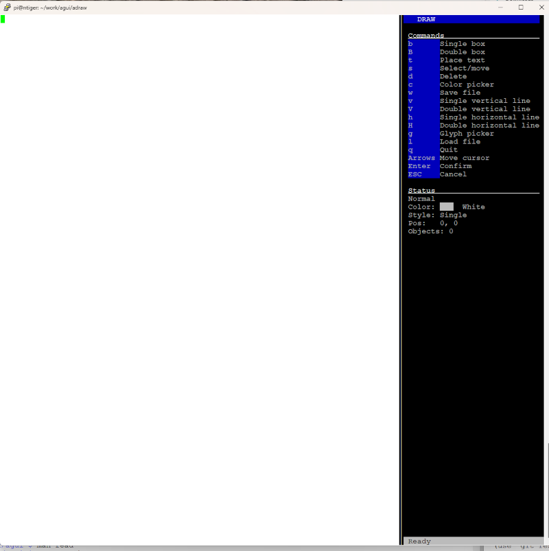

# agui
A library that uses the ascii escape codes to display information.

This is only for displaying information and it does not allow for user input other than the use of CTL-C to stop the program.
This does not mean you can not add input support yourself.

NOTE: The capabilities of a terminal program range greatly.  This works fine using the putty program version 0.83.

Be sure and set the configuration of putty session.
Window->Translation->Remote Character set = UTF-8 and
Check Window->Translation->Use Unicode linedrawing code points.

Be sure to use a monospcae font type or boxes will not draw correctly.

I have added a drawing program to help with screen layout called adraw.

I have also added a aguiLoadScreen() to be able to load and display the screen created by adraw.

To make the agui library just type make.

To compile the test_agui program cd to agui_test and type make

To compile the test_adraw program cd to adraw_test and type make

On a RPI 4 you will need to install the ncurses and wide character libraries.

sudo apt install -y libncurses-dev libncursesw-dev

To compile the adraw program cd to adraw_prg and type make

I wrote this library to help display network statics in a putty terminal.  At some point I may make the Netowrk Monitor System avaiiable.
I like terminals to have white backgrounds and black forground colors, so you may have to play around with the aguiSetColor function if you use different colors.

Contact me if you have questions or issues.
Enjoy
